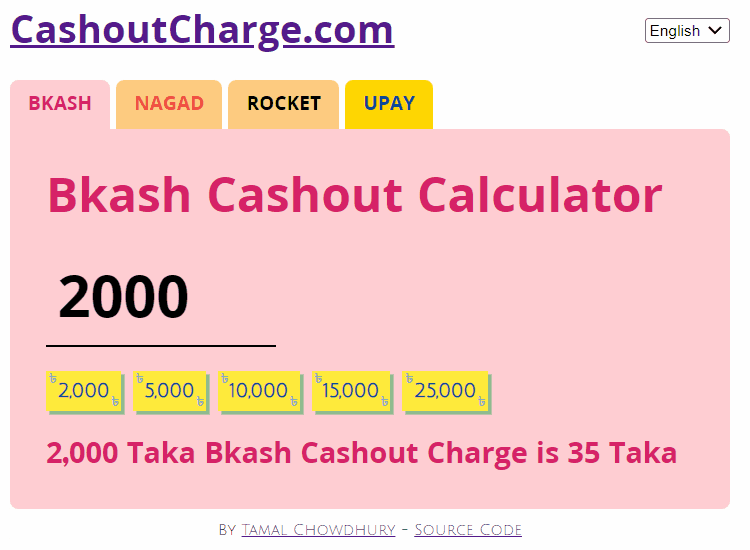

# Cashout Charge App

[CashoutCharge.com](https://cashoutcharge.com) is a local utility app to calculate fees for Bkash, Nagad, Rocket, and Upay financial services. This app is aimed at the Bangladeshi mobile financial service users. Every time a user wants to withdraw (cash out) from their mobile wallet, a charge is cut from their account. It helps to know the cashout fee, so the sender can send the fee amount along with the amount. Finally, this app lets the user calculate a large amount upfront to see how much they will be spending beforehand.



## Building it Locally

You will need to have a [local development server setup](https://tamalweb.com/setup-local-dev-environment) to run this project.

Clone the app 

```sh
git clone https://github.com/tamalchowdhury/cashoutcharge.git
```

CD into the project 

```sh
cd cashoutcharge
```

Install dependencies with `yarn` 

```sh
yarn
```

or `npm`

```sh
npm install
```

Run the local server with `yarn start` or `npm start`.

Visit http://localhost:3000 on your web browser.

All source code are in the `/src` directory.